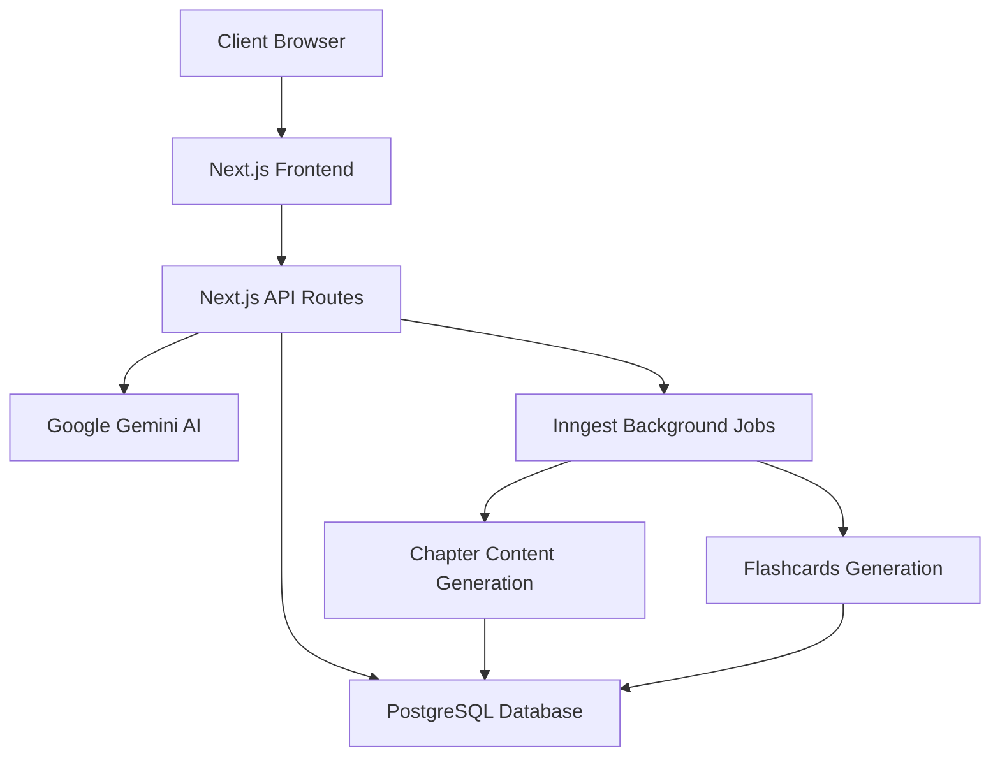
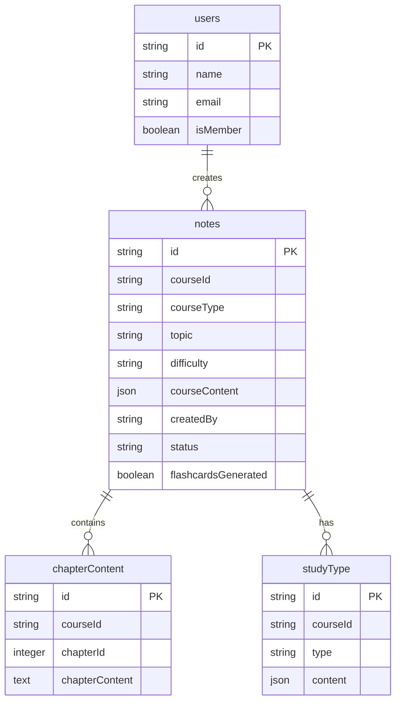
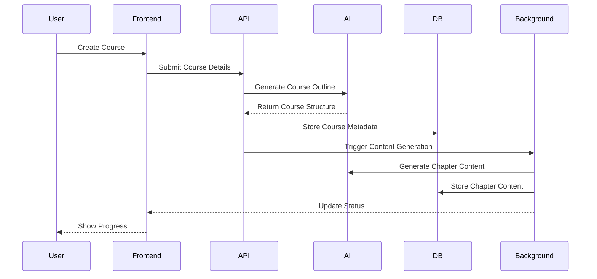
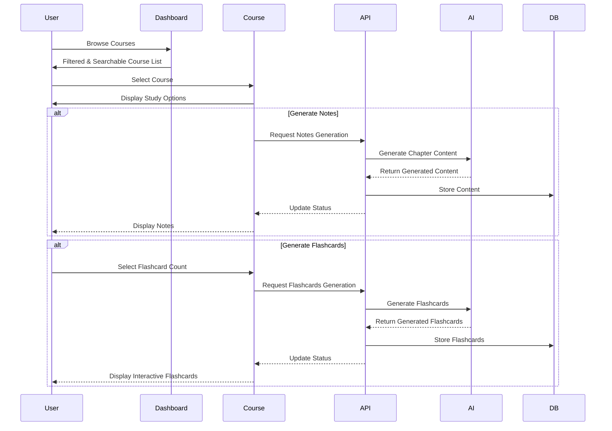

# StudyMate AI

StudyMate AI is an AI-powered study material generation platform that helps users create structured learning content for various purposes, from exam preparation to job-related topics.

## 🚀 Features

### Core Features

- **AI-Powered Course Generation**

  - Automatic course outline generation
  - Chapter-wise content generation
  - Structured study material creation
  - Background processing for content generation

- **User Management**

  - Secure authentication with Clerk
  - User profiles and session management
  - Personalized dashboard

- **Course Management**

  - Create new study materials/courses
  - Categorize content (Exam, Job, Coding, Other)
  - Set difficulty levels (Easy, Medium, Hard)
  - Real-time status updates

- **Dashboard**

  - Personalized welcome screen
  - Course listing and management
  - Progress tracking
  - Real-time status updates
  - **Search and Filtering** (NEW)
    - Filter courses by category (All, Coding, Exam, Job, Other)
    - Search courses by title and description
    - Real-time filtering with result count indicators

- **Study Materials** (NEW)
  - **Notes**
    - Chapter-by-chapter structured content
    - Desktop and mobile-friendly sidebar navigation
    - Auto-scroll to top when switching chapters
  - **Flashcards**
    - Customizable number of flashcard generation (5, 10, 15, 20, 25)
    - Interactive 3D flip animations with gradient effects
    - Circular navigation (loop from last card to first)
    - Motion effects and transitions
    - Mobile responsive design

## 🏗️ Architecture

### System Architecture



### Database Schema



### Course Generation Flow



### Study Materials Flow



## 🛠️ Tech Stack

### Frontend

- Next.js 15.1.7
- React 19
- TailwindCSS
- Radix UI Components
- Framer Motion
- 3D Transformations and Animations

### Backend

- Next.js API Routes
- PostgreSQL (NeonDB)
- Drizzle ORM
- Clerk Authentication
- Google Generative AI (Gemini)
- Inngest Background Processing

## 🚀 Getting Started

1. Clone the repository
2. Install dependencies:

```bash
npm install
```

3. Set up environment variables:

```bash
cp .env.sample .env
# Fill in your environment variables
```

4. Run the development server:

```bash
npm run dev
```

5. Open [http://localhost:3000](http://localhost:3000) with your browser

## 📝 Environment Variables

Required environment variables:

- `DATABASE_URL`: PostgreSQL connection string
- `CLERK_SECRET_KEY`: Clerk authentication secret
- `GOOGLE_API_KEY`: Google Gemini AI API key
- `INNGEST_EVENT_KEY`: Inngest background job key

## 🔒 Security

- Authentication handled by Clerk
- Secure API routes
- Environment variable protection
- Database connection security

## 📦 Project Structure

```
studymate-ai/
├── app/
│   ├── api/                # API routes
│   ├── dashboard/          # Dashboard pages
│   │   └── _components/    # Dashboard components
│   ├── create/             # Course creation
│   ├── course/             # Course pages
│   │   ├── [courseId]/     # Dynamic course routes
│   │   │   ├── notes/      # Notes pages and components
│   │   │   └── flashcards/ # Flashcards pages and components
│   │   └── _components/    # Shared course components
│   └── (auth)/             # Authentication pages
├── components/             # Reusable components
├── configs/                # Configuration files
├── hooks/                  # Custom React hooks
├── lib/                    # Utility functions
└── styles/                 # Global styles
```

## 🤝 Contributing

1. Fork the repository
2. Create your feature branch
3. Commit your changes
4. Push to the branch
5. Create a new Pull Request

## 📄 License

This project is licensed under the MIT License - see the LICENSE file for details.
