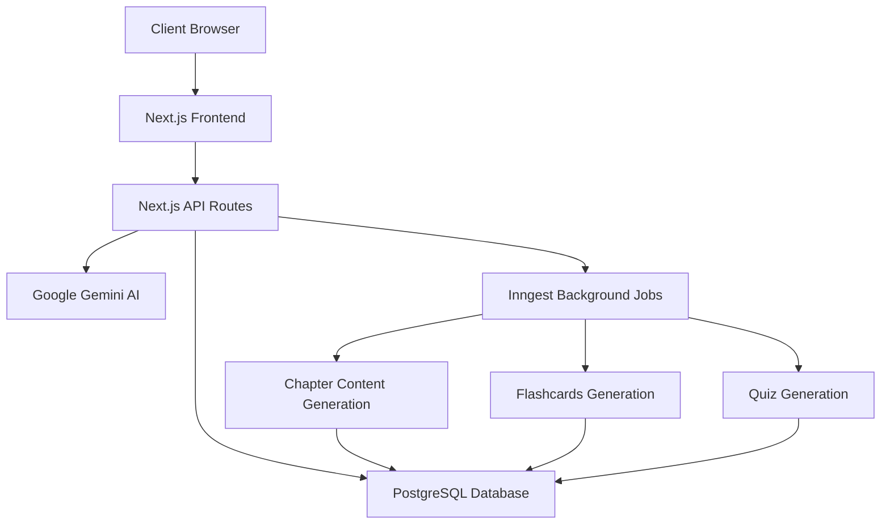
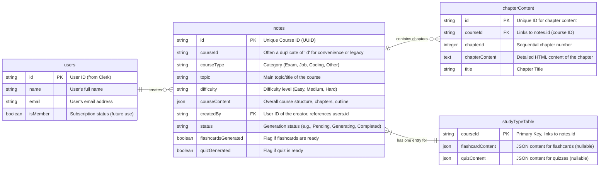
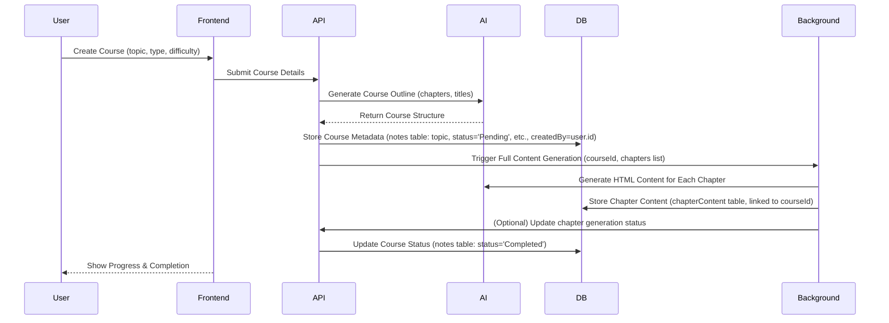
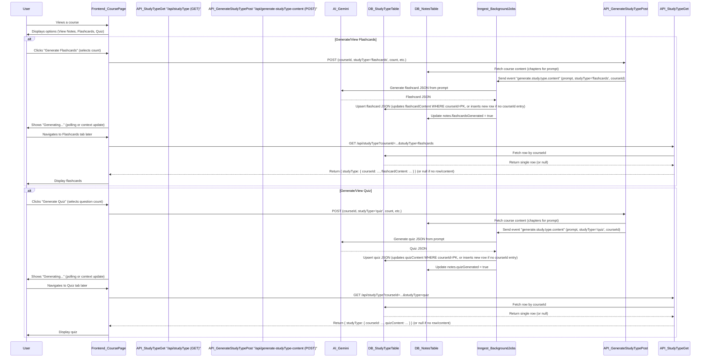

# StudyMate AI

StudyMate AI is an AI-powered study material generation platform that helps users create structured learning content for various purposes, from exam preparation to job-related topics.

## 🚀 Features

### Core Features

- **AI-Powered Course Generation**

  - Automatic course outline generation
  - Chapter-wise content generation
  - Structured study material creation
  - Background processing for content generation

- **User Management**

  - Secure authentication with Clerk
  - User profiles and session management
  - Personalized dashboard

- **Course Management**

  - Create new study materials/courses
  - Categorize content (Exam, Job, Coding, Other)
  - Set difficulty levels (Easy, Medium, Hard)
  - Real-time status updates
  - `quizGenerated` flag to track quiz availability

- **Dashboard**

  - Personalized welcome screen
  - Course listing and management
  - Progress tracking
  - Real-time status updates
  - **Search and Filtering**
    - Filter courses by category (All, Coding, Exam, Job, Other)
    - Search courses by title and description
    - Real-time filtering with result count indicators

- **Study Materials**
  - **Notes**
    - Chapter-by-chapter structured content
    - Desktop and mobile-friendly sidebar navigation
    - Auto-scroll to top when switching chapters
  - **Flashcards**
    - Customizable number of flashcard generation (5, 10, 15, 20, 25)
    - Interactive 3D flip animations with gradient effects
    - Circular navigation (loop from last card to first)
    - Motion effects and transitions
    - Mobile responsive design
  - **Interactive Quizzes** (NEW)
    - Customizable number of question generation (5, 10, 15, 20, 25)
    - Multiple-choice questions
    - Instant feedback with correct answers and explanations
    - Score calculation
    - Option to retake quiz
    - "Clear Answer" functionality for individual questions
    - Responsive design for various screen sizes
    - Submission requires all questions to be answered (toast notification for incomplete attempts)

## 🏗️ Architecture

### System Architecture



### Database Schema



### Course Generation Flow



### Study Materials Flow



## 🛠️ Tech Stack

### Frontend

- Next.js (e.g., 14.x)
- React (e.g., 18.x)
- TailwindCSS
- Shadcn/UI (Radix UI & Tailwind CSS)
- Framer Motion
- Lucide React Icons
- React Markdown (for rendering Markdown in quizzes)
- Highlight.js (for syntax highlighting in notes & quizzes)

### Backend

- Next.js API Routes
- PostgreSQL (NeonDB)
- Drizzle ORM
- Clerk Authentication
- Google Generative AI (Gemini Pro)
- Inngest (Background Job Processing)

## 🚀 Getting Started

1. Clone the repository:
   ```bash
   git clone https://github.com/your-username/studymate-ai.git
   cd studymate-ai
   ```
2. Install dependencies:
   ```bash
   npm install
   # or
   # yarn install
   # or
   # pnpm install
   ```
3. Set up environment variables:
   Create a `.env` file by copying `.env.sample`:
   ```bash
   cp .env.sample .env
   ```
   Fill in the required values in your `.env` file.
4. Initialize or update the database schema:
   If using Drizzle Kit migrations (recommended):
   ```bash
   npx drizzle-kit generate # Generate migration if schema changed
   npx drizzle-kit migrate  # Apply migrations
   ```
   Or, for direct push (use with caution, especially on existing data):
   ```bash
   npx drizzle-kit push
   ```
5. Run the development server:
   ```bash
   npm run dev
   ```
6. Open [http://localhost:3000](http://localhost:3000) with your browser.

## 📝 Environment Variables

Ensure the following environment variables are set in your `.env` file:

- `DATABASE_URL`: Your PostgreSQL connection string (e.g., from NeonDB).
- `NEXT_PUBLIC_CLERK_PUBLISHABLE_KEY`: Your Clerk publishable key.
- `CLERK_SECRET_KEY`: Your Clerk secret key.
- `GOOGLE_API_KEY`: Your Google Generative AI (Gemini) API key.
- `INNGEST_EVENT_KEY`: Your Inngest event key (for sending events).
- `INNGEST_SIGNING_KEY`: Your Inngest signing key (for verifying webhooks, if applicable).
- `NEXT_PUBLIC_CLERK_SIGN_IN_URL=/sign-in`
- `NEXT_PUBLIC_CLERK_SIGN_UP_URL=/sign-up`
- `NEXT_PUBLIC_CLERK_AFTER_SIGN_IN_URL=/dashboard`
- `NEXT_PUBLIC_CLERK_AFTER_SIGN_UP_URL=/dashboard`

## 🔒 Security

- Authentication and user management handled by Clerk.
- Secure API routes with appropriate request validation.
- Environment variables managed via `.env` file (ensure it's in `.gitignore`).
- Database connection security (SSL/TLS recommended with NeonDB).
- Input sanitization and validation to prevent common web vulnerabilities.

## 📦 Project Structure

```
studymate-ai/
├── app/
│   ├── (auth)/               # Authentication pages (sign-in, sign-up)
│   │   └── [[...sign-in]]/
│   │   └── [[...sign-up]]/
│   ├── api/                  # API routes
│   │   ├── courses/
│   │   ├── create-user/
│   │   ├── generate-course-outline/
│   │   ├── generate-studyType-content/
│   │   ├── inngest/          # Inngest webhook handler
│   │   ├── notes/
│   │   └── studyType/
│   ├── course/               # Course-specific pages
│   │   ├── [courseId]/       # Dynamic route for a specific course
│   │   │   ├── flashcards/   # Flashcards page and components
│   │   │   │   └── page.jsx
│   │   │   │   └── layout.jsx
│   │   │   ├── notes/        # Notes page and components
│   │   │   │   └── _components/
│   │   │   │   └── page.jsx
│   │   │   │   └── layout.jsx
│   │   │   ├── quiz/         # Quiz page and components (NEW)
│   │   │   │   └── page.jsx
│   │   │   │   └── layout.jsx
│   │   │   └── layout.jsx    # Layout for a specific course
│   │   └── _components/      # Shared components for course pages (e.g., StudyMaterial.jsx)
│   ├── create/               # Page for creating new courses
│   │   └── page.jsx
│   ├── dashboard/            # User dashboard
│   │   └── _components/
│   │   └── page.jsx
│   ├── context/              # React Context providers (e.g., CourseContext.jsx)
│   ├── layout.jsx            # Root layout
│   └── page.jsx              # Root page (homepage)
├── components/               # Reusable UI components (Shadcn/UI based)
│   └── ui/                   # Generated Shadcn UI components
├── configs/                  # Configuration files (db.js, gemini.js, schema.js)
├── hooks/                    # Custom React hooks (e.g., use-toast.js)
├── inngest/                  # Inngest client and function definitions
├── lib/                      # Utility functions and libraries
├── public/                   # Static assets
├── .env                      # Environment variables (Gitignored)
├── .env.sample               # Sample environment variables
├── .eslintrc.json            # ESLint configuration
├── .gitignore                # Git ignore file
├── components.json           # Shadcn/UI configuration
├── drizzle.config.js         # Drizzle ORM configuration
├── middleware.js             # Next.js middleware (e.g., for Clerk auth)
├── next.config.mjs           # Next.js configuration
├── package.json              # Project dependencies and scripts
├── postcss.config.mjs        # PostCSS configuration
├── README.md                 # This file
└── tailwind.config.mjs       # Tailwind CSS configuration
```
