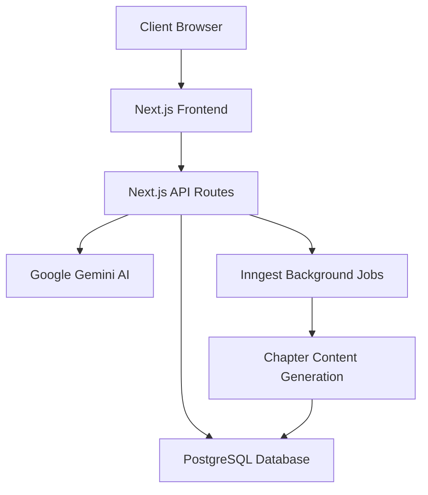
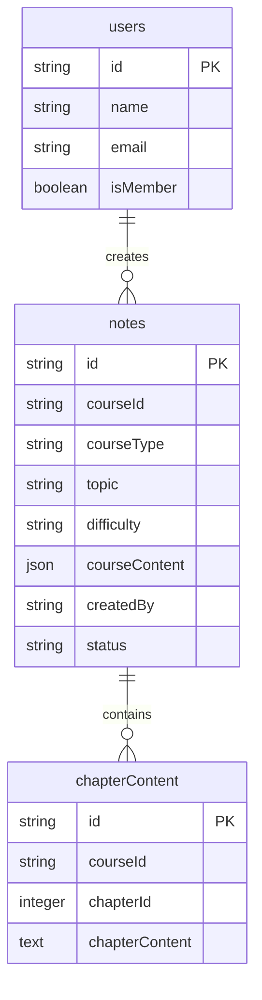

# StudyMate AI

StudyMate AI is an AI-powered study material generation platform that helps users create structured learning content for various purposes, from exam preparation to job-related topics.

## 🚀 Features

### Core Features

- **AI-Powered Course Generation**

  - Automatic course outline generation
  - Chapter-wise content generation
  - Structured study material creation
  - Background processing for content generation

- **User Management**

  - Secure authentication with Clerk
  - User profiles and session management
  - Personalized dashboard

- **Course Management**

  - Create new study materials/courses
  - Categorize content (Exam, Job, Coding, Other)
  - Set difficulty levels (Easy, Medium, Hard)
  - Real-time status updates

- **Dashboard**
  - Personalized welcome screen
  - Course listing and management
  - Progress tracking
  - Real-time status updates

## 🏗️ Architecture

### System Architecture



### Database Schema



### Course Generation Flow


## 🛠️ Tech Stack

### Frontend

- Next.js 15.1.7
- React 19
- TailwindCSS
- Radix UI Components
- Framer Motion

### Backend

- Next.js API Routes
- PostgreSQL (NeonDB)
- Drizzle ORM
- Clerk Authentication
- Google Generative AI (Gemini)
- Inngest Background Processing

## 🚀 Getting Started

1. Clone the repository
2. Install dependencies:

```bash
npm install
```

3. Set up environment variables:

```bash
cp .env.sample .env
# Fill in your environment variables
```

4. Run the development server:

```bash
npm run dev
```

5. Open [http://localhost:3000](http://localhost:3000) with your browser

## 📝 Environment Variables

Required environment variables:

- `DATABASE_URL`: PostgreSQL connection string
- `CLERK_SECRET_KEY`: Clerk authentication secret
- `GOOGLE_API_KEY`: Google Gemini AI API key
- `INNGEST_EVENT_KEY`: Inngest background job key

## 🔒 Security

- Authentication handled by Clerk
- Secure API routes
- Environment variable protection
- Database connection security

## 📦 Project Structure

```
studymate-ai/
├── app/
│   ├── api/           # API routes
│   ├── dashboard/     # Dashboard pages
│   ├── create/        # Course creation
│   └── (auth)/        # Authentication pages
├── components/        # Reusable components
├── configs/          # Configuration files
├── hooks/            # Custom React hooks
├── lib/              # Utility functions
└── styles/           # Global styles
```

## 🤝 Contributing

1. Fork the repository
2. Create your feature branch
3. Commit your changes
4. Push to the branch
5. Create a new Pull Request

## 📄 License

This project is licensed under the MIT License - see the LICENSE file for details.
